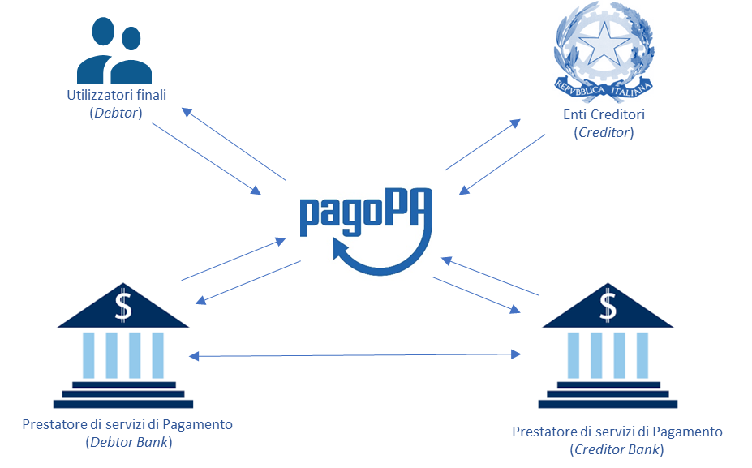

+----------+
| |image0| |
+----------+

+-------------------------------------------------------+
| **SEZIONE II – REGOLE DI FUNZIONAMENTO DEL SISTEMA**  |
+-------------------------------------------------------+

SEZIONE II – Regole di funzionamento del sistema
================================================

I due diversi *workflow* gestiti sul Sistema pagoPA si differenziano principalmente in base al soggetto che innesca il pagamento. Avremo quindi un
processo diverso se l’utilizzatore finale accede al servizio di pagamento attraverso tecnologie e funzioni messe a disposizione da un Ente Creditore
ovvero attraverso tecnologie e funzioni messe a disposizione da un Prestatore di Servizi di Pagamento

Nella presente sezione è modellato il processo di scambio dati tra i sistemi informativi dei tre soggetti che partecipano a ogni processo di pagamento
mediati dal NodoSPC.

La modellazione risultante descrive quindi, da una parte, le specifiche che definiscono il comportamento progettato del NodoSPC, riportando un set di
informazioni certe e conosciute (le primitive rese disponibili dai Web Services, i dati di configurazione, etc.) e, in un’altra parte, il
comportamento atteso dei sistemi intermediati riportando l’insieme di informazioni minime indispensabili alle funzioni informatiche effettivamente
sviluppate dai soggetti aderenti in qualità di Enti Creditori o Prestatori di Servizi di Pagamento.

I dettagli delle primitive utilizzate in ciascun *workflow*, i tracciati, gli errori e tutte le informazioni tecniche necessarie per integrare servizi
di Enti Creditori e Prestatori di Servizi di Pagamento con il NodoSPC sono descritti nella sezione III.

La modellazione segue le notazioni dello standard *Business Process Model and Notation* (BPMN) versione 2.0, di cui si riporta, in Figura 3, i simboli
utilizzati e il loro significato.

|image4|

**Figura 3 – Notazioni BPMN 2.0 utilizzate**

Gestione della posizione debitoria
----------------------------------

Come previsto dalle Linee guida, tutte le tipologie di pagamento gestite dal Sistema pagoPA prevedono che l’Ente Creditore, per rendere realizzabile
un pagamento, registri nei propri archivi le informazioni necessarie per effettuare il pagamento e le metta a disposizione dell’utilizzatore finale.
Definiamo l’insieme di tali informazioni con il termine di “posizione debitoria”.

Nel Sistema pagoPA ogni pagamento presuppone la creazione propedeutica, nel sistema informativo dell’Ente Creditore, di una posizione debitoria.
All’Ente Creditore compete la gestione degli stati del ciclo di vita della posizione debitoria, che, in linea generale, corrispondono alle attività
di:

1. Creazione. La posizione debitoria viene creata dall’ Ente Creditore e posta nello stato di “Aperta”. Si sottolinea che, al fine della
   semplificazione tecnica del sistema, si definisce “posizione debitoria” sia la creazione che avviene su iniziativa dell’Ente Creditore (es.
   maturazione delle condizioni per il pagamento di una imposta) sia quella che avviene su iniziativa dell’utente (es. richiesta di un servizio),
   anche se in quest’ultimo caso l’utilizzatore finale non è effettivamente in debito con l’Ente Creditore fino a quando non acquista il servizio.

2. Aggiornamento. La posizione debitoria viene aggiornata dell’Ente Creditore ogni qualvolta intervengano eventi che modificano le informazioni
   associate a una posizione debitoria (es sanzioni per decorrenza dei termini). A valle di tale aggiornamento la posizione debitoria riamane in stato
   di aperta, ma l’Ente Creditore gestisce lo storico delle versioni.

3. Blocco. La posizione debitoria viene bloccata, a discrezione dell’Ente Creditore, nelle more del perfezionamento di un pagamento, onde evitare
   pagamenti ripetuti.

4. Trasferimento. La posizione debitoria è posta nello stato di trasferita nel caso in cui la competenza dell’incasso passi a un altro Ente Creditore
   (es. iscrizione in ruolo).

5. Chiusura. L’Ente Creditore pone la posizione debitoria nello stato “Chiusa” ogni qualvolta intervengano eventi che la rendano non più pagabile (es
   saldo del debito). Lo stato è reversibile nel caso in cui intervenga una revoca del pagamento che pone di nuovo la posizione debitoria in una nuova
   versione dello stato di “Aperta”.

Contestualmente alla creazione di una posizione debitoria, l’Ente Creditore, se ne ricorrono le condizioni, deve predisporre un avviso di pagamento,
in almeno una delle seguenti forme:

a) Analogico (sotto forma di avviso cartaceo o file stampabile), da recapitare all’utilizzatore finale o che stampa egli stesso effettuando, se
   previsto, il downloading dal sito web dell’Ente Creditore. Tutti i dettagli relativi all’avviso di pagamento analogico sono inclusi nel documento
   collegato *“Il nuovo avviso di pagamento analogico nel sistema pagoPA”* pubblicata sul sito dell’Agenzia per l’Italia Digitale.

b) Digitale, da inviare al NodSPC per essere recapitato al servizio di *repository* del Prestatore di Servizi di Pagamento scelto dall’utilizzatore
   finale.

L’avviso è lo strumento che rende possibile l’innesco del pagamento presso i Prestatori di Servizi di Pagamento, che l’Ente Creditore genera ogni
qualvolta le norme lo obbligano a notificare a un cittadino o a un’impresa l’insorgenza di una posizione debitoria aperta nei loro confronti. In
questo caso l’Ente creditore genera contestualmente anche un avviso in modalità digitale, che mantiene comunque un carattere bonario.

L’avviso di pagamento analogico, oltre al logotipo del Sistema pagoPA, contiene le informazioni indispensabili per l'esecuzione del pagamento, che
sono dettagliate nella sezione III.

Si attira l’attenzione sulla circostanza che l’importo dell’avviso di pagamento contenuto nell’avviso analogico è quello corrispondente al momento
della produzione di tale documento e quindi può essere soggetto a variazioni (in più o in meno) al momento in cui ne viene richiesto il pagamento da
parte dell’utilizzatore finale, nel caso sia intervenuto un aggiornamento della posizione debitoria, purché tale possibilità sia stata effettivamente
esplicitata in una avvertenza sull’avviso..

La peculiarità di alcune postazioni messe a disposizione dai Prestatori di Servizi di Pagamento rende necessario automatizzare l’acquisizione dei dati
presenti sull’avviso di pagamento. Per questo motivo tale documento è corredato, oltre che dati essenziali sopra citati, anche da un insieme di
elementi grafici facilmente leggibili e decodificabili da apposite apparecchiature.

I processi di creazione, aggiornamento, chiusura o annullamento di una posizione debitoria sono interni al sistema informativo dell’Ente Creditore.
Nei casi previsti tali operazioni scatenano l’invio di un avviso di pagamento con strumenti digitali (avvisatura digitale), il cui processo è
tracciato nel seguito.

Con l’avvisatura digitale l’Ente Creditore permette agli utenti di accedere allo stato corrente della propria posizione debitoria. Attraverso il
Sistema pagoPA è possibile gestire due tipologie di avvisatura digitale:

-  Avvisatura digitale *push*, ovvero su iniziativa dell’Ente Creditore

-  Avvisatura digitale *pull*, ovvero su iniziativa di un Prestatore di Servizi di Pagamento per soddisfare una richiesta dell’utilizzatore finale

I paragrafi che seguono descrivono i *workflow* gestiti da pagoPA nei due casi.

Avvisatura digitale *push* (su iniziativa dell’Ente Creditore)
~~~~~~~~~~~~~~~~~~~~~~~~~~~~~~~~~~~~~~~~~~~~~~~~~~~~~~~~~~~~~~

La funzione di avvisatura digitale in modalità *push* è un servizio messo a disposizione dal Sistema pagoPA attraverso il NodoSPC che consente agli
utilizzatori finali di ricevere avvisi in formato elettronico, in modo che il correlato pagamento possa essere effettuato in modalità semplice e
sicura utilizzando il Sistema pagoPA. Salvo diverso avviso le notifiche digitali hanno un carattere bonario e quindi si affiancano a quelle
tradizionali, già previste dalla normativa, senza sostituirle. Tuttavia, per consentire ai propri clienti la più ampia possibilità di utilizzare tale
strumento innovativo, l’Ente Creditore è incentivato a utilizzarle anche nelle circostanze in cui la normativa non pone un obbligo formale di
notifica.

Per poter ricevere un avviso digitale l'utilizzatore finale dovrà dotarsi di un “cassetto digitale” che il NodoSPC utilizzerà per il recapito,
mediante la sottoscrizione di uno specifico contratto con un soggetto abilitato da AgID a erogare tale servizio. I Prestatori di Servizi di Pagamento
hanno la possibilità di integrare con essa ulteriori funzioni quali, a titolo di esempio, i servizi di pagamento offerti sul Sistema pagoPA, notifiche
sui dispositivi da essi gestiti, (*app* su PC, *tablet* e *smartphone*, servizio di *home* *banking*, ecc.), gestione delle scadenze, ecc.

Si puntualizza che l’utilizzatore finale, ossia il soggetto che riceve l’avvisatura da parte dell’Ente Creditore, è sempre il soggetto debitore
dell’Ente Creditore e che, in quanto l’utilizzatore finale è chiamato a procedere al relativo pagamento che materialmente potrà comunque essere
eseguito da un terzo soggetto (versante) in nome e per conto del debitore (pagatore).

L'adesione al servizio da parte dei Prestatori di Servizi di Pagamento è facoltativa, mentre gli Enti Creditori che generano un avviso analogico
pagabile presso i Prestatori di Servizi di Pagamento dovranno obbligatoriamente sviluppare tale funzionalità.

Il servizio in oggetto è monodirezionale in quanto prevede la distribuzione di avvisi digitali da parte degli Enti Creditori verso gli Utilizzatori
finali, ma non prevede una risposta da parte di questi ultimi.

L'iscrizione al servizio di avvisatura effettuata dall'utilizzatore finale presso il Prestatore di Servizi di Pagamento avrà efficacia per la
ricezione di avvisi da parte di tutti gli Enti Creditori aderenti al Sistema pagoPA.

L'utente finale può iscriversi al servizio di avvisatura presso più Prestatori di Servizi di Pagamento: in questo caso, in fase di iscrizione presso
un altro Prestatore di Servizi di Pagamento dovrà ricevere una segnalazione di iscrizione "multipla" da parte del Prestatore di servizi di pagamento
che sta trattando l'operazione.

La revoca dell’iscrizione al servizio di avvisatura deve essere richiesta al Prestatore di Servizi di Pagamento, che ne stabilisce le modalità.

Nel processo di avvisatura *push* (Figura 4) sono coinvolti quattro soggetti:

-  utilizzatore finale

-  Ente Creditore

-  NodoSPC

-  Prestatore Servizi di Pagamento dell’Utilizzatore finale

|image5|

**Figura 4 – Il processo di gestione dell’avvisatura push**

Il processo di avvisatura *push* è iniziato dall’Ente Creditore quando genera una posizione debitoria (*Task* T1.1.1). Una volta generata la posizione
debitoria, l’Ente Creditore invia al NodoSPC gli avvisi digitali da recapitare (*Task* T1.1.2).

Il NodoSPC (*Task* T1.1.3) esegue azioni differenti a seconda che l’utilizzatore finale sia iscritto o meno al servizio presso un Prestatore Servizi
di Pagamento (*Gateway* G1.1.1):

-  Nel caso in cui l’utilizzatore finale sia iscritto tramite Prestatore Servizi di Pagamento, il NodoSPC invia l’avviso digitale al Prestatore
   Servizi di Pagamento (*Task* T1.1.3) che lo storicizza in un proprio database e ne dà notifica all’Utilizzatore finale (*Task* T1.1.4) in modo che
   sia a disposizione dello stesso (*Task* T1.1.5)

-  Negli altri casi, il NodoSPC non esegue alcuna azione.

Nel caso in cui l’Ente Creditore modifichi uno dei dati obbligatori dell’avviso (ad esempio: l’importo), dovrà inviare al NodoSPC una nuova copia
dell’avviso digitale con l’indicazione che si tratta di un aggiornamento.

Nel caso in cui l’Ente Creditore annulli un avviso digitale o tale avviso risulti pagato con modalità diverse dal Sistema pagoPA, dovrà inviare al
NodoSPC una nuova copia dell’avviso digitale con l’indicazione che si tratta di una cancellazione.

Il processo di aggiornamento e annullamento dell’avviso digitale è analogo a quello della generazione (Figura 5).

Avvisatura digitale *pull* (verifica della posizione debitoria)
~~~~~~~~~~~~~~~~~~~~~~~~~~~~~~~~~~~~~~~~~~~~~~~~~~~~~~~~~~~~~~~

L’avvisatura *pull* è una funzionalità messa a disposizione dell'utilizzatore finale che consente allo stesso di accedere alla propria posizione
debitoria.

Il Sistema pagoPA mette a disposizione tale funzione affinché la posizione debitoria di un utilizzatore finale possa essere interrogata attraverso
altre funzioni messe a disposizione dal Prestatori di Servizi di Pagamento presso il quale egli è titolare di un cassetto digitale, purché tale
Prestatore di Servizi di Pagamento risulti aderente all'iniziativa. Tale servizio viene erogato con un’interrogazione della base dati dell’Ente
Creditore di competenza, integrato con il “cassetto digitale”, e avviene secondo uno schema sincrono, attivato dall'utilizzatore finale stesso
attraverso le stesse modalità descritte nel paragrafo precedente.

Nel processo in oggetto (Figura 5) sono coinvolti quattro soggetti:

-  utilizzatore finale

-  Ente Creditore

-  NodoSPC

-  Prestatore Servizi di Pagamento dell’utilizzatore finale

|image6|

**Figura 5 – Il processo di gestione dell’avvisatura pull**

Il processo segue i seguenti passi:

-  L’utilizzatore finale accede ad una degli strumenti messi a disposizione dal Prestatore di Servizi di Pagamento richiedendo di conoscere la sua
   (*Task* T1.3.1) posizione debitoria

-  Il Prestatore di servizi di Pagamento inoltra la richiesta all’Ente Creditore attraverso il NodoSPC (*Task* T1.3.2 e T1.3.3)

-  L’Ente Creditore predispone la lista delle Posizione Debitorie relative all’utilizzatore finale (Task T1.3.4) e le inoltra al Prestatore di Servizi
   di Pagamento attraverso il NodoSPC (Task T1.3.5).

-  Il Prestatore di servizi di Pagamento riceve la posizione debitoria dell’Utilizzatore finale e può informarlo (*Task* T1.3.6)

-  L’utilizzatore finale a questo punto ha a disposizione la propria posizione debitoria (*Task* T1.3.7)

Al fine di prevenire utilizzi non consoni, il NodoSPC si riserva la possibilità di applicare apposite regole di *throttling* (limitazioni
nell'utilizzo). Le eventuali regole di *throttling* sono indicate nel documento “\ *Indicatori di qualità per i Soggetti Aderenti*\ ” pubblicato sul
sito istituzionale dell’Agenzia per l’Italia Digitale.

Il Processo di pagamento attivato presso l’Ente Creditore
---------------------------------------------------------

Rientrano in questa categoria di pagamenti quelli richiesti dall’utilizzatore finale attraverso i siti web o *mobile app* o altri strumenti
tecnologici messi a disposizione dagli Enti Creditori per i pagamenti elettronici. Il processo di pagamento attivato presso l’Ente Creditore consente
di gestire le modalità di incasso sia nel caso in cui l’utilizzatore finale abbia ricevuto un avviso di pagamento, sia nel caso opposto (pagamenti
spontanei)

Le attività a carico degli Enti Creditori per gestire il processo sono rappresentate dalla realizzazione delle procedure di pagamento (sia in termini
organizzativi, che informatici); le procedure di pagamento potranno essere più o meno strettamente integrate con i servizi cui fanno riferimento.

Il diagramma di Figura 8 descrive il processo di pagamento attraverso l’Ente Creditore. Al fine di rendere tale diagramma immediatamente leggibile la
descrizione del *workflow* è stata aggregata in sottoparagrafi secondo lo schema logico che segue (Figura 6).

|image7|

**Figura 6 – Schema logico del processo di business del pagamento presso l’Ente Creditore**

Nel processo in oggetto (Figura 7) sono coinvolti quattro soggetti:

-  utilizzatore finale

-  Ente Creditore

-  NodoSPC

-  Prestatore Servizi di Pagamento dell’utilizzatore finale

|image8|

**Figura 7 – Il processo del pagamento da Ente Creditore**

**Avvio del pagamento**

Come descritto nei paragrafi precedenti, l’utilizzatore finale può eseguire un pagamento per ragioni diverse che generano due diramazioni distinte
(gateway G2.1.1) nel caso abbia disponibile o meno un avviso di pagamento (digitale e analogico).

**Generazione posizione debitoria**

La generazione della posizione debitoria è l’evento che costituisce la premessa al pagamento sul Sistema pagoPA.

In determinate circostanze, previste nello specifico dalla vigente normativa, un soggetto matura un debito in favore di una Pubblica Amministrazione
(centrale o locale). In questo caso lo stesso Ente Creditore assume l’iniziativa di generare una posizione debitoria e provvede a notificare l’avviso
di pagamento al soggetto pagatore. L’EC è altresì tenuto ad accompagnare la notifica con avviso analogico, anche con l’invio al NodoSPC di un avviso
digitale *push*. Questa attività è parte del processo di avvisatura digitale.

Nel caso non sussistano le circostanze sopra indicate per il pagamento dovuto, ovvero l’utilizzatore finale non sia in possesso di un avviso digitale,
lo stesso utilizzatore può assumere l’iniziativa di avviare il pagamento (pagamento spontaneo). In questo caso, se l’utilizzatore finale accede a
portali messi a disposizione dall’Ente Creditore, la posizione debitoria è generata (*Task* T2.1.1). È facoltà dell’EC esporre delle funzioni che
consentono al soggetto pagatore di riceve un avviso digitale (nel caso abbia aderito al servizio) ovvero provveda alla stampa di un avviso analogico,
da utilizzare per disporre il pagamento presso i Prestatori di Servizi di Pagamento che offrono tale opzione.

**Scelta canale di pagamento**

L’utilizzatore finale accede ai sistemi dell’EC per pagare uno o più avvisi che gli sono stati recapitati e/o uno o più pagamenti spontanei e l’Ente
Creditore genera il carrello di richieste di pagamento telematico reindirizzando l’utilizzatore finale sul portale WISP (*Task* T2.1.2).

Il NodoSPC prende in carico il carrello delle richieste di pagamento telematico (*Task* T2.1.3) mentre l’Utilizzatore finale sceglie il Prestatore di
Servizi di Pagamento e il canale di pagamento.

Per gli utilizzatori finali che scelgono di registrarsi al Sistema pagoPA sono a disposizione funzioni di supporto che consentono di memorizzare le
scelte di pagamento effettuate per poterle richiamare e riutilizzare nelle successive occasioni. In questo caso è possibile eleggere una delle scelte
come predefinita così da avere un’esperienza quanto più possibile simile alla modalità *one-click* tipica dei siti di *e-commerce*.

I dati personali raccolti saranno trattati, nel rispetto della normativa vigente, solo per consentire l’erogazione dei servizi richiesti.

Pertanto, detti dati saranno trattati esclusivamente per consentire agli utenti delle pubbliche amministrazioni e degli altri soggetti aderenti al
Sistema pagoPA di richiedere e ottenere i servizi di pagamento erogati dai Prestatori di Servizi di Pagamento abilitati sul Sistema pagoPA, nonché per
richiedere e ottenere parimenti i servizi di identificazione e memorizzazione erogati da AgID sul Sistema pagoPA.

Il conferimento dei dati ed il trattamento degli stessi da parte di AgID per tali finalità è dunque obbligatorio e non richiede un esplicito consenso,
pena l’impossibilità per l’AgID di erogare i servizi sopra citati.

**Autorizzazione del pagamento**

L’autorizzazione del pagamento viene effettuata in maniera differente a seconda del servizio scelto dall’utilizzatore finale:

-  In caso di pagamento con carta di credito o di debito (*Gateway* G2.1.2), l’Utilizzatore finale immette (o recupera nel caso li abbia
   precedentemente memorizzati) i dati della carta (*Task* T2.1.4) e gli viene proposto il pagamento in una *check out page* gestita dal NodoSPC.

..

   Questa tipologia di pagamento prevede che l’autorizzazione del pagamento da parte dell’utilizzatore finale sia inizializzata dal NodoSPC,
   attraverso un proprio POS virtuale. Nel caso che la carta utilizzata sia stata emessa da un Prestatore di servizi di Pagamento aderente al Sistema
   pagoPA, il relativo gestore dell’operazione sarà proposto automaticamente all’utilizzatore finale. Questa casistica è denominata pagamento “on us”.
   Nel caso in cui l’utilizzatore finale non confermi tale scelta ovvero il Prestatore di Servizi di Pagamento emittente della carta non aderisca al
   Sistema pagoPA, l’utilizzatore finale dovrà scegliere il gestore dell’operazione da una lista di Prestatori di servizi di pagamento che mostri i
   costi della commissione richiesta per il servizio. In questo caso si realizza un pagamento “not on us”.

   I Prestatori di Servizi di Pagamento che offrono il servizio di pagamento con carta devono:

-  indicare al NodoSPC le commissioni richiesta per i pagamenti “on us” e i pagamenti “not on us”;

-  Configurare sul NodoSPC le informazioni necessarie a configurare il dialogo tecnico con il POS virtuale con il NodoSPC.

..

   I dettagli delle procedure da seguire sono riportati nella sezione IV.

   Sul portale dell’Ente Creditore devono essere messe a disposizione le funzioni che permettono all’utilizzatore finale di interrogare lo stato della
   sua richiesta di pagamento, scaricare una copia di ricevuta o quietanza di pagamento, scaricare copia analogica e/o duplicato del documento
   informatico Ricevuta Telematica.

-  In caso di pagamento con autorizzazione gestita dal Prestatore Servizi di Pagamento (a cui si assimila anche il pagamento attraverso il circuito
   MyBank, purché sia previsto un pagamento singolo) (*Gateway* G2.1.3), il NodoSPC inoltra in *back-end* il carrello al Prestatore di Servizi di
   Pagamento (o al Wrapper Mybank) (*Task* T2.1.5). Se il canale di pagamento del Prestatore di Servizi di Pagamento lo prevede, l’esperienza utente
   del processo di pagamento può proseguire in un *front-end* gestito dal Prestatore di Servizi di Pagamento (quindi esterno al NodoSPC), prevedendo
   l’identificazione del soggetto versante che autorizza il pagamento (*Task* T2.1.8). In ogni caso, a valle della autorizzazione, l’utilizzatore
   finale viene reindirizzato al *front-end* dell’Ente Creditore da cui aveva avviato il pagamento (*Task* T2.1.9).

..

   Queste tipologie di pagamento prevedono che l’autorizzazione del pagamento da parte dell’utilizzatore finale avvenga mediante l’interazione con
   strumenti messi a disposizione dal Prestatore di Servizi di Pagamento. L’esecuzione del pagamento ed il rilascio della relativa attestazione (RT)
   avvengono in funzione delle modalità di autorizzazione del pagamento adottate dal Prestatore di Servizi di Pagamento. Si distingue quindi
   l’autorizzazione:

-  contestuale alla richiesta effettuata, in funzione dei livelli di servizio pattuiti con il Prestatore di Servizi di Pagamento, se l’utilizzatore
   finale ha pre-autorizzato il pagamento (ad esempio: lettera di manleva o altro strumento contrattuale);

-  non contestuale, se l’autorizzazione viene rilasciata successivamente alla ricezione della richiesta di pagamento telematico da parte del
   Prestatore di Servizi di Pagamento, attraverso canali da questo messi a disposizione (ad esempio: home banking, notifica su app per smartphone o
   tablet, ecc.).

..

   In ogni caso il Prestatore di Servizi di Pagamento deve restituire la ricevuta telematica nei tempi stabiliti secondo quanto previsto nel documento
   “Indicatori di qualità per i soggetti aderenti” pubblicato sul sito istituzionale dell’AgID, in modo da consentire all’utilizzatore finale di
   usufruire dei servizi per cui ha pagato.

   Nel caso di pre-autorizzazione del pagamento, resta salva la possibilità per l’utilizzatore finale di revocare il consenso rilasciato al Prestatore
   di Servizi di Pagamento ad eseguire un’operazione di pagamento, in presenza delle condizioni previste all’articolo 17 del Decreto legislativo n.
   11/2010.

A questo punto, nei casi diversi dall’autorizzazione presso il Prestatore di Servizi di Pagamento, per il quale l’autorizzazione avviene al di fuori
del NodoSPC, l’Utilizzatore finale decide se autorizzare (*Task* T2.1.11):

-  In caso negativo, se il metodo di pagamento scelto era carta di credito (*Gateway* G2.1.7) il NodoSPC genera una ricevuta telematica negativa
   (*Task* T2.1.14), altrimenti è il Prestatore di Servizi di Pagamento che genera la ricevuta telematica negativa (*Task* T2.1.15)

-  In caso positivo, se l’Utilizzatore effettua il pagamento con carta (*Gateway* G2.1.6) il NodoSPC inoltra la richiesta di pagamento telematico al
   Prestatore Servizi di Pagamento (*Task* T2.1.12), altrimenti il Prestatore Servizi di Pagamento incassa il pagamento (*Task* T2.1.12)

Una volta effettuato l’incasso il Prestatore Servizi di Pagamento genera la ricevuta telematica, redirezionando sul sito dell’Ente Creditore in caso
di carta di credito, (*Task* 2.1.16) e la trasmette al NodoSPC (*Task* T2.17).

Il NodoSPC mette la ricevuta telematica a disposizione del’Ente Creditore (*Task* 2.1.17) che a sua volta può mettere a disposizione dell’Utilizzatore
finale una ricevuta (*Task* T2.18).

L’Utilizzatore finale a questo punto può ottenere la ricevuta (Task T2.1.19) e terminare il processo.

**Accredito e rendiconto**

Dopo aver effettuato il pagamento, il Prestatore Servizi di Pagamento lo accredita sul conto dell’Ente Creditore (*Task* T2.1.20).

Il Prestatore Servizi di Pagamento invia i dati relativi alla rendicontazione al NodoSPC (*Task* T2.1.21).

Il NodoSPC trasmette i dati di rendicontazione all’Ente Creditore (*Task* T2.1.22), che li riceve (*Task* T2.1.23).

Processo di pagamento attivato presso il Prestatore di Servizi di Pagamento
---------------------------------------------------------------------------

Questo processo prevede che l’esecuzione del pagamento avvenga presso le infrastrutture messe a disposizione dal Prestatore di Servizi di Pagamento
quali, ad esempio, sportelli ATM, applicazioni di *Home banking* e *mobile* *payment*, uffici postali, punti della rete di vendita dei generi di
Monopolio (Tabaccai), SISAL e Lottomatica, casse predisposte presso la Grande Distribuzione Organizzata, ecc.

L’Ente Creditore che consente il pagamento deve mettere a disposizione dei Prestatori di Servizi di Pagamento, attraverso il NodoSPC, un archivio nel
quale siano già stati memorizzati i pagamenti predisposti dall’ente (Archivio Pagamenti in Attesa).

Per rendere possibile il pagamento l’Ente Creditore ha l’obbligo di recapitare all’utilizzatore finale un avviso con gli estremi del pagamento da
effettuare. Tale recapito deve obbligatoriamente avvenire sia in modalità analogica (tramite servizi postali), che digitale. L’Ente Creditore può
inoltre adottare ulteriori misure per la diffusione degli avvisi di pagamento, per esempio rendere disponibili funzioni di stampa on line tramite il
proprio sito.

Il processo di pagamento descritto di seguito, supporta principalmente la modalità di incasso su iniziativa dell’Ente Creditore, ma può essere
utilizzato anche per gestire la modalità di incasso su iniziativa del debitore, atteso che, sul proprio portale, l’Ente Creditore metta a disposizione
dell’utilizzatore finale la possibilità di eseguire pagamenti presso gli sportelli dei Prestatori di Servizi di Pagamento generando a richiesta del
debitore, un avviso di pagamento utilizzabile all’uopo.

Anche il modello di pagamento in esame può essere utilizzato dall’utente per tutti quei servizi per i quali non è necessario disporre in via immediata
dell’attestazione di pagamento, che può essere esibita in un momento successivo.

Nello schema di Figura 10 è trattato il caso in cui l’utilizzatore finale, già in possesso dell’avviso di pagamento analogico fornito dall’Ente, si
rechi presso le strutture del Prestatore di Servizi di Pagamento e comunichi il codice dell'avviso di pagamento. Si tenga presente che il caso d’uso
descritto non dipende dalla concreta modalità in cui tale dato entra in possesso del Prestatore di Servizi di Pagamento: il codice potrebbe essere
comunicato a un operatore di sportello, letto automaticamente tramite dispositivi ottici, inserito manualmente dal soggetto versante su interfacce
messe a disposizione dai Prestatori di Servizi di Pagamento (un terminale ATM, una pagina WEB, ecc.), ovvero, da ultimo, comunicato tramite avviso
digitale.

Il diagramma di Figura 10 descrive il processo pagamento operato presso il Prestatore di Servizi di Pagamento. Al fine di rendere tale diagramma
immediatamente leggibile la descrizione del *workflow* è stata aggregata in paragrafi secondo lo schema logico che segue (Figura 8).

|image9|

**Figura 8 – Schema logico del processo di business del pagamento presso il Prestatore di Servizi di Pagamento**

Nel processo in oggetto (Figura 9) sono coinvolti quattro soggetti:

-  Utilizzatore finale

-  Ente Creditore

-  NodoSPC

-  Prestatore Servizi di Pagamento dell’Utilizzatore finale

|image10|

**Figura 9 – Il processo del pagamento attivato presso il Prestatore di Servizi di Pagamento**

Avvio del pagamento
~~~~~~~~~~~~~~~~~~~

Come descritto nei paragrafi precedenti, l’Utilizzatore finale può eseguire un pagamento per ragioni diverse, che generano due diramazioni distinte
(gateway G2.2.1), nel caso che abbia disponibile o meno un avviso di pagamento (digitale e analogico).

Generazione posizione debitoria
~~~~~~~~~~~~~~~~~~~~~~~~~~~~~~~

La generazione della posizione debitoria è l’evento che costituisce la premessa al pagamento sul Sistema pagoPA.

In determinate circostanze, previste nello specifico dalla vigente normativa, un soggetto matura un debito in favore di una Pubblica Amministrazione
(centrale o locale). In questo caso lo stesso Ente Creditore assume l’iniziativa di genera una posizione debitoria e provvede a notificare l’avviso di
pagamento al soggetto pagatore. L’EC è altresì tenuto ad accompagnare la notifica con avviso analogico, anche con l’invio al NodoSPC di un avviso
digitale *push*. Questa attività è parte del processo di avvisatura digitale.

Nel caso in cui non sussistano le circostanze sopra indicate per il pagamento dovuto, ovvero l’Utilizzatore finale non sia in possesso di un avviso
digitale, l’Utilizzatore stesso può assumere l’iniziativa di avviare il pagamento (pagamento spontaneo), purché sia disponibile la relativa funzione.
In questo caso l’Utilizzatore finale accede a portali messi a disposizione dal Prestatore di Servizi di Pagamento e quest’ultimo richiede all’Ente
Creditore la generazione della posizione debitoria (*Task* T2.2.1). L’Ente Creditore risponde con l’invio al Prestatore Servizi di Pagamento di un
numero avviso (*Task* T2.2.2) che può essere consegnato all’Utilizzatore (Task T2.2.3) che dunque può decidere se autorizzare (*Task* T2.2.8).

Verifica posizione debitoria e attivazione richiesta di pagamento telematica
~~~~~~~~~~~~~~~~~~~~~~~~~~~~~~~~~~~~~~~~~~~~~~~~~~~~~~~~~~~~~~~~~~~~~~~~~~~~

Nel caso in cui l’Utilizzatore finale abbia ricevuto un avviso di pagamento e abbia deciso di pagare tramite un Prestatore Servizi di Pagamento,
quest’ultimo, prima di effettuare il pagamento, può verificare la posizione debitoria utilizzando la specifica funzione, per accertarsi che il
pagamento non sia stato saldato e/o i termini siano rimasti invariati (per esempio potrebbe essere variato l’importo a causa di interessi di mora)

Allorché il Prestatore Servizi di Pagamento chiede la verifica della posizione debitoria (*Gateway* G2.2.3), l’Ente Creditore risponde (Task T2.2.5)
con i dati previsti riguardo lo stato della posizione debitoria, nonché le possibili variazioni dell'importo dovute ad eventi successivi all'invio
dell'Avviso analogico, ad esempio il superamento della data di scadenza del pagamento). L’invocazione della funzione di verifica non ha effetti sullo
stato della posizione debitoria.

In caso di sussistenza della posizione debitoria l’Utilizzatore finale può decidere se pagare o meno (*Gateway* G2.2.2).

-  Se decide di pagare, allora viene attivata la richiesta di pagamento telematico (*Task* T2.2.7)

-  In caso contrario il processo termina (*Task* T2.2.4)

Il Prestatore Servizi di Pagamento può, viceversa, invocare direttamente l’attivazione della richiesta di pagamento telematico (*Task* T2.2.6),
peraltro comprendente la verifica della posizione debitoria.

L’Ente Creditore esegue l’attivazione della richiesta di pagamento telematico (*Task* T2.2.7.

Il processo si svolge poi diversamente nei casi in cui l’Utilizzatore finale ha effettuato o meno il pagamento prima che il Prestatore di Servizi di
Pagamento richiedesse l’attivazione della richiesta di pagamento telematico (*Gateway* G2.2.6).

Nel caso che l’Utilizzatore finale non abbia ancora pagato, deve decidere se autorizzare il pagamento (*Gateway* G2.2.4):

-  In caso negativo, se non esisteva ancora una richiesta di pagamento telematico attiva (*Gateway* G2.2.7) è perché il Prestatore di Servizi di
   Pagamento aveva richiesto la verifica della posizione debitoria, quini il processo termina, altrimenti il Prestatore di Servizi di Pagamento genera
   una ricevuta telematica negativa (*Task* T2.2.10)

-  In caso positivo il Prestatore Servizi di Pagamento incassa il pagamento (*Task* T2.2.9)

Una volta effettuato l’incasso (*Task* T2.2.9) il Prestatore Servizi di Pagamento genera la ricevuta telematica positiva (*Task* T2.2.11) se aveva già
ricevuto una richiesta di pagamento telematico attivata (*Gateway* G2.2.5), perché lo aveva richiesto, altrimenti richiede la attivazione della
richiesta di pagamento telematico (*Task* T2.2.6) che viene generata dall’Ente Creditore (*Task* T2.2.7) e solo a questo punto il Prestatore Servizi
di Pagamento può generare la ricevuta telematica positiva (*Task* T2.2.11).

Nel caso di emissione di ricevuta telematica positiva il Prestatore di Servizi di Pagamento consegna all’Utilizzatore finale un’attestazione di
pagamento, contenente le informazioni specificate nella sezione III. Tale attestazione è opponibile all’EC.

Le ricevute telematiche sia positive che negative vengono trasmesse al NodoSPC.

Il NodoSPC mette la ricevuta telematica a disposizione dell’Ente Creditore (*Task* 2.2.12) che a sua volta può mettere a disposizione
dell’Utilizzatore finale una ricevuta (*Task* T2.2.13).

L’Utilizzatore finale a questo punto può ottenere la ricevuta (Task T2.2.14) e terminare il processo.

Trasmissione dati di accredito e rendicontazione
~~~~~~~~~~~~~~~~~~~~~~~~~~~~~~~~~~~~~~~~~~~~~~~

Dopo aver effettuato il pagamento, il Prestatore Servizi di Pagamento accredita il conto dell’Ente Creditore specificato dalla richiesta di pagamento
telematico ed invia al NodoSPC i dati relativi alla ricevuta telematica accreditata (*Task* T2.2.15

Nel caso che in cui venga effettuato un accredito cumulativo il Prestatore Servizi di Pagamento invia i dati relativi alla rendicontazione al NodoSPC
(*Task* T2.2.16).

Il NodoSPC mette a disposizione i dati di rendicontazione per l’Ente Creditore (*Task* T2.2.17). Quando l’Ente Creditore scarica i dati di
rendicontazione (*Task* T2.2.18).

Attivazione della richiesta di pagamento
~~~~~~~~~~~~~~~~~~~~~~~~~~~~~~~~~~~~~~~~

Il NodoSPC non controlla l’effettiva sequenza operativa scelta dal Prestatore di Servizi di Pagamento, relativa alle fasi del processo descritte in
precedenza: pertanto, un Prestatore di Servizi di Pagamento potrebbe effettuare la richiesta di attivazione della richiesta di pagamento telematico
senza aver preventivamente effettuato la fase di verifica. Con questo approccio è sconsigliato far precedere l’incasso alla richiesta di attivazione
della richiesta di pagamento telematico (*Task* T2.2.6), in quanto sul Sistema pagoPA non è gestito automaticamente il caso in cui l'Ente Creditore
non riesca a inviare la richiesta di pagamento telematico prevista dal *workflow*: per esempio, nel caso in cui il pagamento sia già stato eseguito
con un altro canale oppure perché l'importo dovuto sia diverso da quello stampato sull'avviso.

In questo caso il Prestatore di Servizi di Pagamento avrebbe incassato dei fondi ai quali non può essere associata una Ricevuta Telematica da inviare
all'Ente Creditore. Per questo caso, nella sezione III, sono previste delle gestioni semi-manuali. A tal proposito si ricorda che, ai sensi delle
Linee guida, i pagamenti effettuati attraverso il NodoSPC sono liberatori del debito a condizione che la Ricevuta Telematica sia congruente con le
informazioni presenti sulla relativa richiesta di pagamento telematico e quindi sull'archivio dei pagamenti in attesa.

Funzioni accessorie
-------------------

Revoca della Ricevuta Telematica
~~~~~~~~~~~~~~~~~~~~~~~~~~~~~~~~~

Qualora l’utilizzatore finale - ai sensi degli articoli 13 e 14 del decreto legislativo 27 gennaio 2010, n. 11, ovvero per richieste regolamentate
connesse all’utilizzo di carte di pagamento (c.d.: procedura di *charge back*, nella quale non rientrano i casi di frode ma unicamente i casi in cui
l’Utilizzatore finale richieda un rimborso per un pagamento effettuato a fronte di un servizio di cui non ha usufruito) chieda al proprio prestatore
di servizi di pagamento il rimborso di un pagamento già completato, il Sistema pagoPA mette a disposizione di Prestatori di Servizi di Pagamento e
Enti Creditori idonee funzionalità per gestire la revoca della ricevuta telematica inviata in precedenza.

Come indicato in Figura 10, la revoca della ricevuta telematica si esplica nell’invio di una richiesta di revoca (RR) da parte del Prestatore di
Servizi di Pagamento, contenente i riferimenti della ricevuta telematica oggetto della revoca e nella risposta da parte dell’Ente Creditore contenente
l’esito della revoca (ER).

|image11|

**Figura 10 – Il processo di revoca**

Il processo è iniziato dall’Utilizzatore finale, che richiede la revoca al proprio Prestatore di Servizi di Pagamento (*Task* T3.1), a seguito della
quale quest’ultimo inoltra la richiesta all’Ente Creditore (*Task* T3.2) attraverso il NodoSPC (*Task* T3.3).

L’Ente Creditore esamina la richiesta (*Gateway* G3.1):

-  L'Ente Creditore non consente la revoca di una ricevuta telematica se il pagamento associato è contestuale all'erogazione di un servizio (ad
   esempio: acquisto di biglietti per musei o trasporti pubblici, prestazioni sanitarie già eseguite, ecc.) inviando un ER di esito negativo (*Task*
   T3.4) che viene trasmesso dal NodoSPC al Prestatore di servizi di Pagamento (*Task* T3.5) e da questi all’Utilizzatore finale (*Task* T3.6) che
   apprende l’esito (*Task* T3.5)

-  In caso contrario l’Ente Creditore, entro tempi compatibili con il procedimento richiesto, esamina la richiesta e invia l'esito della revoca,
   aggiornando i propri archivi informatici e riaprendo la posizione debitoria se necessario (*Task* T3.8). L’esito positivo è trasmetto dal NodoSPC
   al Prestatore di Servizi di Pagamento (*Task* T3.9), il quale esegue il riaccredito verso l’Utilizzatore finale (*Task* T3.10), il quale lo riceve
   direttamente senza l’intervento del NodoSPC (*Task* T3.7). Il Prestatore di servizi di Pagamento recupera la somma dovuta compensandola sui
   successivi accrediti da effettuare verso l’Ente Creditore ed espone la cifra (negativa) sul successivo rendiconto (*Task* T3.11), che viene
   trasmesso all’Ente Creditore attraverso il NodoSPC (*Task* T3.12). A questo punto l’Ente Creditore è in grado di riconciliare correttamente gli
   importi (*Task* T3.13)

In ogni caso, l’Ente Creditore deve predisporre - e darne evidenza sul proprio sito attraverso il quale sono effettuati i pagamenti - apposite
procedure amministrative di back-office al fine di gestire, nel rispetto della normativa vigente, i flussi relativi a reclami, rimborsi e revoche sia
dal punto di vista amministrativo, sia dal punto di vista contabile.

Annullo tecnico
~~~~~~~~~~~~~~~

L’annullo tecnico è una casistica dell’invio di una richiesta di revoca che indica che la RT inviata è tecnicamente errata, dunque il Prestatore di
Servizi di Pagamento può invocarla unicamente ricorra uno dei seguenti casi di errori procedurali:

a) Invio di una Ricevuta Telematica (RT) con esito **positivo**, tuttavia l’utilizzatore finale non ha ricevuto nessun addebito né il Prestatore di
      Servizi di Pagamento ha emesso alcuna attestazione di pagamento (scontrino, ricevuta, e-mail, ecc.);

b) Invio di una Ricevuta Telematica (RT) con esito **negativo**, tuttavia l’utilizzatore finale ha ricevuto un addebito e il Prestatore di Servizi di
      Pagamento ha emesso un’attestazione di pagamento (scontrino, ricevuta, e-mail, ecc.)

Al di fuori delle circostanze sopra descritte l’utilizzo dell’annullo tecnico non è ammesso.

Il processo di annullo tecnico, descritto in Figura 11, è il seguente

|image12|

**Figura 11 – Processo di annullo tecnico**

Il Prestatore di servizi di Pagamento invia la richiesta di annullo tecnico al NodoSPC (*Task* T4.1), che verifica la casistica del caso (*Gateway*
G4.1):

-  Nel caso in cui sia stata inviata una ricevuta telematica positiva senza l’avvenuto pagamento, il nodo aggiorna lo stato del pagamento ed invia
   l’informazione all’Ente Creditore (*Task* T4.2), il quale aggiorna i suoi archivi informatici (*Task* T4.4)

-  Nel caso in cui sia stata inviata una ricevuta telematica negativa a fronte di un avvenuto pagamento, in NodoSPC invia l’informazione di effettuare
   l’annullo tecnico (*Task* T4.3) sia all’Ente Creditore, in quale aggiorna i propri archivi informatici (*Task* T4.4), che al Prestatore di servizi
   di Pagamento, il quale può procedere all’invio dell’accredito (*Task* T4.6), che viene ricevuto dall’Ente Creditore (*Task* T4.8) attraverso il
   NodoSPC (*Task* T4.7), che all’inoltro della rendicontazione (*Task* T4.9), che viene anch’esso ricevuto dall’Ente Creditore (*Task* T4.11)
   attraverso il NodoSPC (*Task* T4.10)

Storno del pagamento
~~~~~~~~~~~~~~~~~~~~

Qualora l’Utilizzatore finale chieda a vario titolo l’annullamento (storno) di un pagamento all’Ente Creditore presso il quale questo è stato
disposto, il sistema mette a disposizione dell’Ente Creditore e del Prestatore di Servizi di Pagamento idonee funzionalità del NodoSPC per gestire
detta operazione.

L’Ente Creditore deve predisporre - e darne evidenza sul proprio sito attraverso il quale sono effettuati i pagamenti - apposite procedure
amministrative di back-office al fine di gestire, nel rispetto della normativa vigente, le richieste di storno del pagamento ed i relativi flussi
economici.

|image13|

**Figura 12 – Processo di storno di un pagamento**

Il processo di storno viene iniziato dall’Utilizzatore finale che lo richiede all’Ente Creditore (*Task* T5.1)

L’Ente Creditore esamina la richiesta (*Gateway* G5.1):

-  In caso di esito negativo, l'Ente Creditore comunica l’informazione all’Utilizzatore finale (*Task* T5.2) che apprende l’esito (*Task* T5.3)

-  In caso contrario l’Ente Creditore, entro tempi compatibili con il procedimento richiesto, esamina la richiesta e invia l'esito dello storno,
   aggiornando i propri archivi informatici e riaprendo la posizione debitoria se necessario (*Task* T5.4). L’esito positivo è trasmesso dal NodoSPC
   al Prestatore di Servizi di Pagamento (*Task* T5.5), il quale esegue il riaccredito verso l’Utilizzatore finale (*Task* T5.6) che lo riceve
   direttamente senza l’intervento del NodoSPC (*Task* T5.7). Il Prestatore di Servizi di Pagamento recupera la somma dovuta compensandola sui
   successivi accrediti da effettuare verso l’Ente Creditore ed espone la cifra (negativa) sul successivo rendiconto (*Task* T5.8) che viene trasmesso
   all’Ente Creditore attraverso il NodoSPC (*Task* T5.8). A questo punto l’Ente Creditore è in grado di riconciliare correttamente gli importi
   (*Task* T5.10)

Attestazione del pagamento
~~~~~~~~~~~~~~~~~~~~~~~~~~

L’attestazione di avvenuto pagamento è rappresentata dal documento informatico (Ricevuta Telematica) che l’Ente Creditore riceve dal Prestatore di
Servizi di Pagamento.

L’Ente Creditore deve rendere disponibile, su richiesta dell’utilizzatore finale, tale documento, sia sotto forma di duplicato informatico che sotto
forma di copia analogica dello stesso. Poiché nelle ricevute telematiche possono essere contenuti da 1 a 5 pagamenti aventi lo stesso ente
beneficiario, sarà cura dell’Ente Creditore, se del caso, produrre tante copie analogiche quanti sono i pagamenti effettuati contenuti nella stessa
ricevuta telematica.

Nel caso di pagamento attivato presso il Prestatore di Servizi di Pagamento, questi fornisce direttamente all’Utilizzatore finale un documento
(ricevuta, scontrino, ecc.) che rappresenta un estratto analogico del documento informatico che il Prestatore di Servizi di Pagamento invierà
successivamente all’Ente Creditore. Tale documento può essere utilizzato dall’Utilizzatore finale per ottenere quietanza da parte dell’EC.

Le copie analogiche prodotte dall’Ente Creditore o dai Prestatori di Servizi di Pagamento devono necessariamente contenere, oltre al logo del Sistema
pagoPA, almeno le seguenti informazioni:

-  Data e ora dell’operazione

-  Codice fiscale e denominazione dell’Ente Creditore

-  Identificativo univoco versamento (IUV) - Identificativo univoco assegnato dall’Ente Creditore

-  Codice identificativo del Prestatore di Servizi di Pagamento

-  Numero univoco assegnato al pagamento dal Prestatore di Servizi di Pagamento

-  Importo dell’operazione

-  Causale del versamento indicata nella richiesta di pagamento telematico.

Riconciliazione dei pagamenti
~~~~~~~~~~~~~~~~~~~~~~~~~~~~~

Con rifermento alle macro-fasi del processo, una volta effettuata la fase di “Regolamento contabile” da parte del Prestatore di Servizi di Pagamento,
l’Ente Creditore provvede a riconciliare le ricevute telematiche (RT) con le informazioni contabili fornite dal proprio istituto tesoriere o da Poste
Italiane in relazione agli incassi avvenuti sui c/c postali (ad esempio: Giornale di Cassa per le Pubbliche Amministrazioni che utilizzano il formato
OIL/OPI; altre modalità per le Pubbliche Amministrazioni centrali che possono richiedere tali informazioni alla Ragioneria Generale dello Stato).

Secondo quanto indicato dalle Linee guida e dal suo Allegato A *"Specifiche attuative dei codici identificativi di versamento, riversamento e
rendicontazione*", il Prestatore di Servizi di Pagamento che riceve l’ordine dal proprio cliente o che esegue l’incasso per conto dell’Ente Creditore
può regolare contabilmente l’operazione in modalità singola o in modalità cumulativa, il che comporta per l’Ente Creditore due diverse modalità di
riconciliazione.

**Riconciliazione in modalità singola**

Qualora, a fronte di ogni singolo set di informazioni contenuto in una richiesta di pagamento, il Prestatore di Servizi di Pagamento effettui una
singola disposizione di pagamento nei confronti dell’Ente Creditore per regolare contabilmente l’operazione (ad esempio: l’utilizzo della forma
tecnica “bonifico di tesoreria”), si parla di riconciliazione in modalità singola.

L’operazione di riconciliazione in modalità singola viene effettuata dall’Ente Creditore sulla base della seguente coppia di informazioni presenti
sulla ricevuta telematica inviata dal Prestatore di Servizi di Pagamento all’Ente Creditore:

-  Identificativo univoco versamento (IUV) che deve coincidere con la componente identificativo univoco versamento della causale della disposizione di
   accredito inviata al Prestatore di Servizi di Pagamento dall’Ente Creditore, secondo le indicazioni di cui alla Sezione I dell’Allegato A alle
   Linee guida;

-  ì-esima occorrenza del dato relativo al singolo importo pagato della Ricevuta Telematica che deve coincidere con il dato presente nell’informazione
   della disposizione di accredito inviata al Prestatore di Servizi di Pagamento dall’Ente Creditore.

**Riconciliazione in modalità multipla**

Qualora il Prestatore di Servizi di Pagamento effettui un’unica disposizione cumulativa di pagamento nei confronti dell’Ente Creditore per regolare
contabilmente i pagamenti relativi agli esiti contenuti in una o più ricevute telematiche, si parla di Riconciliazione in modalità multipla che viene
effettuata dall’Ente Creditore sulla base dei dati forniti dal proprio istituto tesoriere e di quelli contenuti nel flusso di rendicontazione che il
Prestatore di Servizi di Pagamento deve inviare all’Ente Creditore stesso.

La riconciliazione in questo caso deve essere effettuata in due fasi:

-  nella prima fase il dato identificativo del flusso - presente nella causale del SEPA Credit Transfer inviato dal Prestatore di Servizi di Pagamento
   all’Ente Creditore - deve essere abbinato con quello presente nel Flusso di rendicontazione inviato all’Ente Creditore dal Prestatore di Servizi di
   Pagamento che ha eseguito i pagamenti.

-  Nella seconda fase della riconciliazione l’Ente Creditore abbinerà i dati contenuti nel Flusso di rendicontazione di cui sopra con i dati presenti
   nelle ricevute telematiche (RT) memorizzate presso di sé sulla base della seguente coppia di informazioni:

a. Identificativo univoco versamento presente sulla ricevuta telematica inviata all’Ente Creditore che deve coincidere con lo stesso dato presente
   nella struttura dati del Flusso di rendicontazione;

b. importo presente sulla ricevuta telematica inviata all’Ente Creditore che deve coincidere con il dato omonimo presente nella struttura dati del
   Flusso di rendicontazione.

Il NodoSPC fornisce apposite funzioni centralizzate a disposizione dei Prestatori di Servizi di Pagamento e degli Enti Creditori, con le quali i primi
possono inviare il Flusso di rendicontazione e gli altri ricevere i dati ivi contenuti.

**Pagamento contenente più accrediti**

Qualora l’utilizzatore finale presenti al Prestatore di Servizi di Pagamento una RPT contenente più pagamenti ovvero presenti un “carrello” di
richieste di pagamento telematico aventi più beneficiari, il Prestatore di Servizi di Pagamento deve effettuare un unico addebito verso l’Utilizzatore
finale al quale attribuisce lo stesso identificativo univoco di riscossione: pertanto l’Ente Creditore dovrà opportunamente tenerne conto nelle
proprie procedure applicative di riconciliazione.

Altre funzioni accessorie
~~~~~~~~~~~~~~~~~~~~~~~~~

Seppur meno utilizzate nella pratica comune, si citano di seguito alcune ulteriori funzione accessorie messe a disposizione dal Sistema pagoPA:

-  Richiesta di una copia della ricevuta telematica

-  Richiesta dell’elenco delle richieste di pagamento telematico pendenti

-  Gestione della ricevuta telematica di notifica decorrenza termini

I dettagli relativi alle suddette funzioni sono riportati nella sezione III

componenti tecniche del NodoSPC
-------------------------------

Il NodoSPC definisce modalità standard per la gestione dei flussi finanziari:

-  adotta gli standard XML ISO 20022 per i tracciati dei flussi finanziari correlati alle singole operazioni;

-  introduce uno standard per la richiesta di pagamento telematico e per la ricevuta telematica di pagamento adottato a livello nazionale su qualunque
      canale di pagamento, al fine di automatizzare la tratta G2B (*Government to Bank*);

-  nell’ambito delle attività legate al commercio elettronico abilita l’interconnessione con i circuiti internazionali di autorizzazione di tali
      pagamenti;

-  assicura l’univocità del pagamento attraverso la definizione di un codice identificativo del pagamento (IUV). Al suddetto identificativo può essere
      associato uno o più oggetti grafici (codice a barre, glifo, QR-code, ecc.), al fine di consentire e facilitare l’effettuazione del pagamento
      attraverso qualunque canale oggi esistente;

-  de-materializza tutte le ricevute di pagamento restituite all’Ente Creditore;

-  de-materializza gli avvisi di pagamento.

Nella Figura 13 sono evidenziate le componenti ed i soggetti che interagiscono tra di loro per consentire lo svolgersi del processo di pagamento
telematico secondo i modelli descritti in precedenza.

|image14|

**Figura 13 – Schema architetturale del Sistema pagoPA**

Gestore del Workflow Applicativo
~~~~~~~~~~~~~~~~~~~~~~~~~~~~~~~~

È la macro-componente principale che ha lo scopo di coordinare l’esecuzione delle richieste di servizio, richiamando componenti di utilità (quali ad
esempio, il modulo per la diagnostica) ed interfacciare l’infrastruttura di Rete SPC.È la macro-componente principale che ha lo scopo di coordinare
l’esecuzione delle richieste di servizio, richiamando componenti di utilità quali ad esempio, il modulo per la diagnostica, e di interfacciare
l’infrastruttura di Rete.

Il Gestore del *Workflow* Applicativo interfaccia sia le applicazioni degli Enti Creditori da cui provengono le richieste di servizio e a cui devono
essere indirizzate le relative risposte applicative, sia i Prestatori di Servizi di Pagamento che abilitano il pagamento sui diversi canali.

Comprende vari agenti software tra cui i principali sono quelli che permettono:

-  la gestione del “Giornale degli Eventi” dove sono registrati - per ogni operazione - tutti gli scambi necessari alla corretta esecuzione del
      processo;

-  la gestione del “Tavolo Operativo” dove sono monitorati tutti i componenti del sistema e lo stato di esecuzione delle operazioni;

-  l’indirizzamento ai singoli servizi e/o sotto-servizi in funzione delle richieste e delle risposte previste dai diversi modelli di funzionamento;

-  la memorizzazione e la gestione delle “richieste di servizio” per la tracciatura delle operazioni e la gestione delle eccezioni;

-  la gestione degli errori;

-  il mantenimento del sincronismo temporale.

Gestore della Connessione
~~~~~~~~~~~~~~~~~~~~~~~~~

La connessione al NodoSPC in applicazione al vigente modello di interoperabilità avviene nelle forme e nei metodi descritti nel documento collegato
“Specifiche di Connessione al sistema pagoPA”, pubblicato sul sito istituzionale di AgID.

 Gestore della Porta di Dominio
~~~~~~~~~~~~~~~~~~~~~~~~~~~~~~~

Questa componente, deprecata e mantenuta per retro compatibilità, si occupa dello scambio dei messaggi da e verso SPC per il colloquio con l’Ente
Creditore secondo gli accordi di servizio stabiliti dalle regole tecniche SPCoop e pubblicati sui registri SICA. In coerenza con le logiche SPCoop,
permette di reindirizzare i messaggi alle Pubbliche Amministrazioni aderenti a SPC anche in via indiretta attraverso le reti territoriali,
eventualmente per mezzo di soggetti intermediari.

Tra le principali attività svolte dalla componente si richiamano, a titolo esemplificativo:

-  incapsulamento delle chiamate dei metodi *Web service*, rendendole disponibili in forma mediata verso la Porta di Dominio;

-  memorizzazione temporanea e trattamento, secondo la priorità indicata, dei messaggi verso la Porta di Dominio;

-  tracciamento dei riferimenti univoci dei messaggi;

-  trattamento degli header dei messaggi scambiati via Porta di Dominio ai fini della correlazione applicativa attuata dalla Porta di Dominio stessa;

-  gestione degli errori e delle conferme di natura trasmissiva;

-  generazione e propagazione dei messaggi d’errore di natura applicativa;

-  mantenimento di un proprio registro degli eventi finalizzato all’aggiornamento del Giornale degli Eventi;

-  mantenimento del sincronismo temporale.

Interfaccia di Canale
~~~~~~~~~~~~~~~~~~~~~

Le attività svolte da questa componente sono analoghe a quelle svolte dal gestore della Porta di Dominio per gli Enti Creditori, ma istanziate per il
rapporto con i singoli Prestatori di Servizi di Pagamento. A tale scopo, il NodoSPC espone una modalità standard di colloquio verso i Prestatori di
Servizi di Pagamento, descritta nella Sezione IV. Nel caso di peculiari modalità tecnico trasmissive richieste dai Prestatori di Servizi di Pagamento,
sempre che di validità generale, possono essere realizzate allo scopo specifiche interfacce software.

Qualora il Prestatore di Servizi di Pagamento lo richieda, la componente permette di interfacciare il Prestatore di Servizi di Pagamento attraverso un
intermediario (soggetto giuridico o circuito) scelto dallo stesso Prestatore di Servizi di Pagamento. Tutti gli oneri derivanti sono a carico del
Prestatore di Servizi di Pagamento che mantiene la titolarità del rapporto con il NodoSPC.

Di seguito le principali attività svolte dalla componente:

-  incapsulamento delle chiamate al fine di renderle disponibili in forma mediata verso gli specifici canali;

-  memorizzazione temporanea dei messaggi applicativi verso i canali;

-  tracciamento dei riferimenti univoci dei messaggi memorizzati/inviati;

-  gestione degli errori e delle conferme di natura trasmissiva;

-  generazione e propagazione dei messaggi d’errore di natura applicativa;

-  mantenimento di un proprio registro degli eventi finalizzato all’aggiornamento del Giornale degli Eventi;

-  mantenimento del sincronismo temporale.

Repository ricevute telematiche
~~~~~~~~~~~~~~~~~~~~~~~~~~~~~~

Il *Repository* costituisce l’archivio in cui sono memorizzate tutte le ricevute telematiche processate dal NodoSPC e non ancora consegnate,
finalizzato al buon funzionamento del sistema.

Il *Repository* consente una verifica in merito al corretto trattamento dei flussi di pagamento del NodoSPC.

Componente Web-FESP
~~~~~~~~~~~~~~~~~~

La componente “Web-FESP” permette di effettuare il pagamento reindirizzando l’Utilizzatore finalee verso una *landing page* messa a disposizione dal
Prestatore di Servizi di Pagamento.

In questo caso:

-  il Prestatore di Servizi di Pagamento consente all’Utilizzatore finale di eseguire il pagamento con i diversi strumenti di pagamento;

-  la componente Web-FESP agisce da normalizzatore e provvede ad uniformare le informazioni ricevute, re-inviandole attraverso il NodoSPC all’Ente
      Creditore per consentire di completare l’operazione di pagamento.

Componente WISP
~~~~~~~~~~~~~~~

La componente “WISP” (*Wizard* Interattivo di Scelta del Prestatore di Servizi di Pagamento) consente all'utilizzatore finale di effettuare la scelta
del Prestatore di Servizi di Pagamento in modalità accentrata presso il NodoSPC, che mette a disposizione apposite pagine che standardizzano a livello
nazionale la *user experience* dei pagamenti verso la Pubblica Amministrazione, garantendo ai Prestatori di Servizi di Pagamento aderenti che
l'esposizione dei servizi da loro offerti sia proposta all'Utilizzatore finale attraverso schemi che consentano pari opportunità di trattamento,
concorrenza e non discriminazione.

La componente WISP inoltre fornisce all’Utilizzatore finale funzioni di supporto introducendo vari accorgimenti per semplificare la *user experience*,
anche nel caso di pagamento con dispositivi mobili. Inoltre l’Utilizzatore finale potrà memorizzare gli strumenti di pagamento utilizzati, evitando di
dover effettuare una nuova ricerca nelle occasioni successive.

Componente Wrapper MyBank
~~~~~~~~~~~~~~~~~~~~~~~~~

Nell'ambito del collegamento tra il NodoSPC ed il circuito *e-commerce* MyBank, la componente "Wrapper MyBank" si occupa di effettuare le necessarie
conversioni di tracciati e di gestire il colloquio tra il NodoSPC e la componente *Initiating Party* messa a disposizione dalla *Seller Bank*,
rendendo possibile l’inoltro della richiesta di pagamento alla *Buyer Bank* ed il ritorno dell'esito del pagamento stesso.

In tale contesto, le *Seller Bank* aderenti al NodoSPC sono tenute ad utilizzare le specifiche di interfacciamento della componente “Wrapper MyBank”.

Componente per la gestione dell'avvisatura digitale in modalità push
~~~~~~~~~~~~~~~~~~~~~~~~~~~~~~~~~~~~~~~~~~~~~~~~~~~~~~~~~~~~~~~~~~~~

La gestione dell'avvisatura digitale in modalità *push* avviene attraverso l'utilizzo di componenti del NodoSPC che consentono:

-  agli Enti Creditori l'invio degli avvisi sia in modalità SFTP (File transfer sicuro), sia attraverso l'utilizzo di appositi *web service*;

-  ai Prestatore di Servizi di Pagamento di inviare via *web service* al NodoSPC le richieste di iscrizione al servizio;

-  al NodoSPC di:

   -  inviare gli avvisi digitali ai Prestatori di Servizi di Pagamento via *web service*;

   -  inviare gli avvisi digitali agli Utilizzatori finali tramite e-mail (protocollo SMTP);

   -  notificare ai servizi di Cittadinanza Digitale gli avvisi digitali (predisposizione per funzionalità future).

File Transfer sicuro
~~~~~~~~~~~~~~~~~~~~

Il NodoSPC mette a disposizione dei soggetti aderenti una piattaforma *client-server* per il trasferimento sicuro dei dati in modalità *File
Transfer*. Tale piattaforma sostituirà progressivamente l'utilizzo delle primitive oggi impiegate per lo scambio di informazioni in modalità massiva
(ad esempio: i flussi di rendicontazione, i totali di traffico, ecc.).

Giornale degli Eventi
~~~~~~~~~~~~~~~~~~~~~

È la componente che raccoglie tutte le informazioni attinenti ad ogni singola operazione sintetizzando le registrazioni effettuate dalle singole
componenti del NodoSPC: FESP; Web FESP; *Repository*, ecc.

Le principali attività svolte dalla componente riguardano:

-  la raccolta delle informazioni attinenti alle operazioni svolte dalle componenti del NodoSPC, come ad esempio:

-  tipo di operazione (RPT; RT; …),

-  identificativo univoco associato all’operazione,

-  *timestamp* dell’evento e della registrazione,

-  componente in cui si verifica l’evento (FESP; Web-FESP; *Repository*);

-  esposizione di un’interfaccia di interrogazione per l’accesso alle registrazioni degli eventi che consente:

-  la selezione degli eventi in base a criteri di ricerca (tipo di operazione, id, ecc.),

-  l’esame nel dettaglio di un evento selezionato;

-  la disponibilità di dati di sintesi (totali di tipo di operazione per stato, per intervallo temporale, ecc.).

Componenti di utilità
~~~~~~~~~~~~~~~~~~~~~

Le componenti di utilità rappresentano un insieme di componenti “di servizio” invocate, in base alle necessità, dal *Workflow* Applicativo per
svolgere ruoli informativi specifici e utilizzabili da più servizi applicativi all'interno del NodoSPC:

-  traduttore XML: struttura e assembla i messaggi XML dei servizi;

-  modulo crittografia: cifra/decifra informazioni e gestisce i certificati crittografici;

-  modulo diagnostico: effettua controlli di natura sintattica e alcuni controlli semantici.

Ognuna delle componenti di utilità, oltre ad attività specifiche alla propria funzione, svolge le attività di interfacciamento ed integrazione con il
gestore del *Workflow* Applicativo.

Sistema di monitoring
~~~~~~~~~~~~~~~~~~~~~

Il sistema di *monitoring* svolge attività di controllo complessivo per quanto attiene alle tematiche di monitoraggio. Tale componente deve essere
considerata come una entità logica indipendente, con un proprio *workflow* specifico e proprie regole di funzionamento, in grado, quindi, di
verificare malfunzionamenti e condizioni di errore di qualsiasi altro modulo.

Nel sistema di *monitoring* è allocata la funzione di *throttling* che limita l’utilizzo del Sistema pagoPA oltre le possibilità di carico da cui
possa conseguire il verificarsi di disservizi generali. Tale funzionalità viene innescata automaticamente nel caso in cui un Ente Creditore tenti di
avviare, nell’unità di tempo, un numero di operazioni di pagamento superiori ai fabbisogni da esso stesso dichiarati. Le regole di *throttling* sono
indicate nel documento “\ *Indicatori di qualità per i Soggetti Aderenti*\ ” pubblicato sul sito istituzionale dell’Agenzia per l’Italia Digitale.

Sistema di Gestione del Tavolo Operativo
~~~~~~~~~~~~~~~~~~~~~~~~~~~~~~~~~~~~~~~~

Il sistema ha lo scopo di fornire il supporto necessario alle attività del Tavolo Operativo, monitorando le altre componenti applicative e avendo
accesso alle informazioni relative ad ogni richiesta di intervento.

Fra le funzioni di supporto al Tavolo operativo è messo a disposizione un sistema di *Interactive Voice Response* (IVR, Risposta Vocale Interattiva)
per istradare le chiamate vocali, integrato a un sistema di *trouble-ticketing* per tracciare tutte le attività di assistenza.

Controlli
~~~~~~~~~

Tutti i flussi/dati scambiati e previsti dai Servizi di Nodo devono risultare conformi agli Standard di Servizio.

Qualora fosse riscontrata una mancata conformità a detti Standard di Servizio, il soggetto ricevente ha l’obbligo:

-  di bloccare l’esecuzione del relativo flusso elaborativo e di trattamento dei dati;

-  rendere disponibile un’evidenza dello stato del flusso a fronte di una eventuale situazione di blocco del flusso stesso.

Servizi applicativi opzionali
~~~~~~~~~~~~~~~~~~~~~~~~~~~~~

Rientrano in questa tipologia le funzioni che il Servizio mette a disposizione dei soggetti appartenenti al Dominio e che possono da questi essere
utilizzate nell’ambito dello svolgimento delle proprie attività.

Totali di traffico
~~~~~~~~~~~~~~~~~~

Il servizio di quadratura dei flussi di traffico mette a disposizione dei soggetti appartenenti al Dominio che ne facciano richiesta, un flusso
periodico relativo a tutte le interazioni (RPT e RT) transitate attraverso il NodoSPC e di stretta pertinenza del singolo richiedente.

Il NodoSPC mette a disposizione dell’Ente Creditore e del Prestatore di Servizi di Pagamento gli strumenti per la ricezione di tali flussi.

Il periodo temporale durante il quale saranno disponibili i flussi relativi ai “Totali di Traffico” non potrà superare i 10 giorni di calendario e
sarà comunque pubblicato sul sito dell’Agenzia per l’Italia Digitale.

.. [1]
    Vedi http://www.indicepa.gov.it/

.. [2]
    Aggiornato con DM 20 marzo 2013, recante "Modifiche all'allegato A del decreto 8 luglio 2005 del Ministro per l'innovazione e le tecnologie,
   recante: «Requisiti tecnici e i diversi livelli per l'accessibilità agli strumenti informatici»" pubblicato in GU Serie Generale n.217 del
   16-9-2013

.. |AGID_logo_carta_intestata-02.png| image:: media/header.png
   :width: 5.90551in
   :height: 1.30277in
.. |image0| image:: media/image1.png
   :width: 3.93701in
   :height: 0.89306in
.. |image1| image:: media/image2.png
   :width: 0.81568in
   :height: 0.4403in

.. |image3| image:: media/image4.png
   :width: 6.43198in
   :height: 0.93413in
.. |image4| image:: media/image5.png
   :width: 4.08163in
   :height: 3.56195in
.. |image5| image:: media/image6.png
   :width: 4.16697in
   :height: 3.89978in
.. |image6| image:: media/image7.png
   :width: 4.37782in
   :height: 3.49935in
.. |image7| image:: media/image8.png
   :width: 6.37446in
   :height: 0.87811in
.. |image8| image:: media/image11.png
   :width: 11.40069in
   :height: 5.63403in
.. |image9| image:: media/image12.png
   :width: 6.63533in
   :height: 0.91405in
.. |image10| image:: media/image13.png
   :width: 12.68504in
   :height: 8.54545in
.. |image11| image:: media/image14.png
   :width: 5.28056in
   :height: 5.63403in
.. |image12| image:: media/image15.png
   :width: 4.95415in
   :height: 4.36631in
.. |image13| image:: media/image16.png
   :width: 4.24028in
   :height: 4.04722in
.. |image14| image:: media/image17.png
   :width: 5.51181in
   :height: 3.85849in
